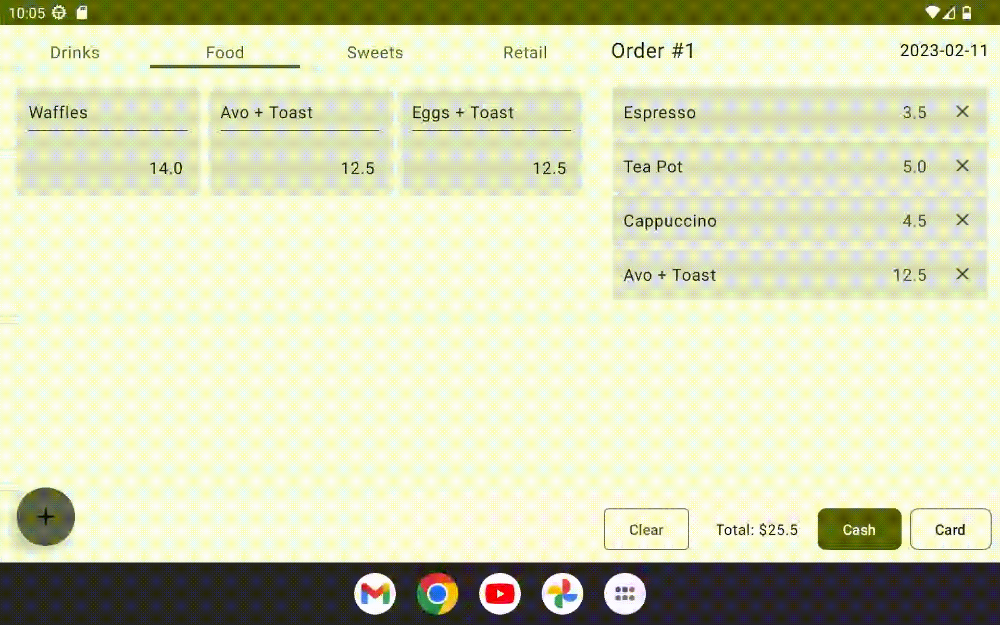

# EZ Android Point-of-Sale
*an MVP Android / Firebase CRUD application*

This project is a beginning into my Mobile App development journey. The main goals are as follows:

- [x] Develop an interactive UI that holds the application's state
- [x] CR - Create and Read data from a cloud Firestore database
- [ ] UD - Update and Delete data from Firestore
- [ ] Implement instrumented tests using JUnit4
- [ ] Implement navigation for additional screens/functionality 

#### **Nice-to-have:**
- email authentication
- Firestore security rules

